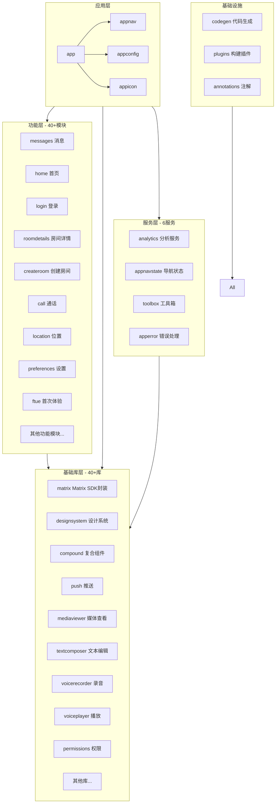
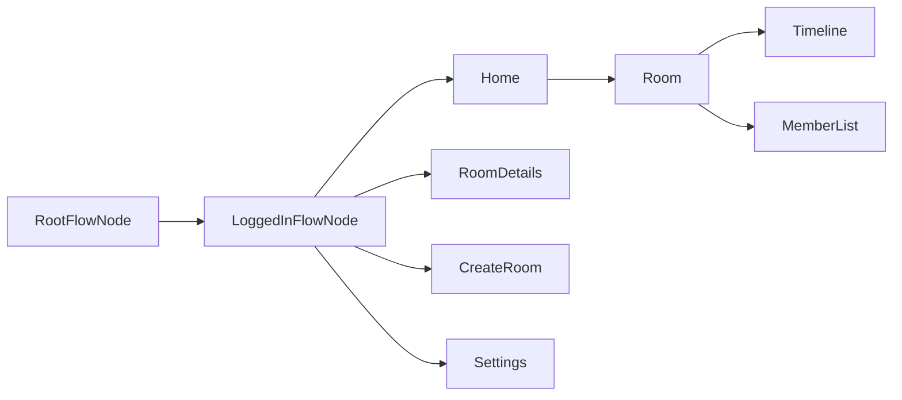

# Element X Android 项目结构详解文档

## 1. 项目概述

Element X Android 是 Element 公司开发的下一代 Matrix 协议客户端应用程序。作为 [Element Classic](https://github.com/element-hq/element-android) 的完全重写版本，该应用采用了现代化的技术栈进行构建。

### 1.1 核心技术栈

本项目采用以下核心技术：

- **Matrix Rust SDK**：底层使用 Matrix Rust SDK，通过 FFI 层与 Kotlin 代码交互，实现跨平台代码共享
- **Jetpack Compose**：完全采用 Jetpack Compose 构建 UI 界面，告别传统的 XML 布局方式
- **Appyx**：使用 Appyx 框架管理应用导航，实现声明式导航架构
- **Kotlin**：主要开发语言，充分利用 Kotlin 的现代语言特性
- **Android 7.0+ (API 24)**：最低支持 Android 7.0 设备，企业版本要求 Android 13+ (API 33)

### 1.2 项目规模统计

- **总文件数**：超过 10,000 个文件
- **Kotlin 源文件**：约 3,855 个
- **Features 模块**：40+ 个功能模块
- **Libraries 库**：40+ 个基础库模块
- **Services 服务**：6 个核心服务模块

---

## 2. 项目目录结构

```
element-x-android-develop/
├── app/                          # 主应用模块
├── appnav/                       # 应用导航模块
├── appconfig/                    # 应用配置模块
├── appicon/                      # 应用图标模块
│   ├── element/                  # Element 标准图标
│   └── enterprise/               # 企业版图标
├── annotations/                  # 自定义注解
├── build.gradle.kts              # 根构建配置
├── settings.gradle.kts           # 项目设置
├── codegen/                      # 代码生成工具
├── enterprise/                   # 企业功能模块
├── features/                     # 功能模块（核心业务逻辑）
├── libraries/                    # 基础库模块
├── plugins/                      # Gradle 插件
├── services/                     # 服务模块
├── tests/                        # 测试模块
├── tools/                        # 工具脚本
├── docs/                         # 文档目录
├── gradle/                       # Gradle 包装器配置
├── screenshots/                  # 截图目录
├── fastlane/                     # 自动化部署配置
├── local.properties              # 本地配置
├── gradle.properties             # Gradle 属性配置
├── README.md                     # 项目说明
├── LICENSE                       # 开源许可证
├── AUTHORS.md                    # 作者列表
├── CONTRIBUTING.md               # 贡献指南
└── CHANGES.md                    # 变更日志
```

---

## 3. 模块组织架构

本项目采用模块化架构设计，主要分为以下几大类模块：



### 3.1 应用模块 (app)

主应用模块，包含应用程序入口点和整体配置。

**目录结构：**
```
app/
├── src/
│   ├── main/
│   │   ├── kotlin/           # 主应用代码
│   │   └── res/              # 资源文件
│   └── test/                 # 单元测试
├── build.gradle.kts          # 构建配置
├── default-proguard-rules.pro # ProGuard 规则
└── signature/                # 签名文件
```

**主要职责：**
- 应用入口点 (`MainActivity`, `ElementApplication`)
- 应用级别配置
- 依赖注入配置
- 多渠道打包配置 (gplay, fdroid)

**Build Types：**
- `debug` - 调试版本
- `release` - 发布版本
- `nightly` - 每日构建版本

**Product Flavors：**
- `gplay` - Google Play 版本（包含 Firebase 推送）
- `fdroid` - F-Droid 版本（无专有依赖）

### 3.2 导航模块 (appnav)

应用导航模块，负责管理应用的整体页面流程。

**主要组件：**
- `RootFlowNode` - 根导航节点
- `LoggedInFlowNode` - 登录后流程
- `JoinedRoomLoadedFlowNode` - 已加入房间流程
- `SyncOrchestrator` - 同步编排器

**职责：**
- 管理用户登录状态流程
- 处理深层链接 (Deep Link)
- 协调各功能模块的导航

### 3.3 配置模块 (appconfig)

应用配置模块，提供各种功能开关和配置常量。

**配置类别：**
```kotlin
├── ApplicationConfig      # 应用基础配置
├── AuthenticationConfig   # 认证配置
├── ElementCallConfig      # Element Call 配置
├── LearnMoreConfig        # 帮助链接配置
├── LockScreenConfig       # 锁屏配置
├── MessageComposerConfig  # 消息编辑器配置
├── NotificationConfig     # 通知配置
├── OnBoardingConfig       # 首次启动配置
├── PushConfig             # 推送配置
├── RageshakeConfig        # 崩溃报告配置
├── RoomListConfig         # 房间列表配置
├── TimelineConfig         # 时间线配置
├── VoiceMessageConfig     # 语音消息配置
└── MatrixConfiguration    # Matrix 服务器配置
```

### 3.4 图标模块 (appicon)

应用图标模块，提供不同版本的图标资源。

**模块：**
- `appicon:element` - Element 标准版图标
- `appicon:enterprise` - 企业版图标

---

## 4. 功能模块详解 (features)

features 目录包含约 40+ 个功能模块，每个模块通常包含以下结构：

```
features/
├── modulename/
│   ├── api/                 # 模块公开接口
│   │   ├── build.gradle.kts
│   │   └── src/main/kotlin/
│   ├── impl/                # 模块实现
│   │   ├── build.gradle.kts
│   │   ├── src/main/kotlin/
│   │   └── src/test/        # 测试代码
│   └── test/                # 测试工具
│       ├── build.gradle.kts
│       └── src/main/kotlin/
```

### 4.1 核心功能模块

| 模块名称 | 功能描述 | 代码行数 |
|---------|---------|---------|
| `messages` | 消息时间线、聊天界面 | 421 文件 |
| `home` | 首页、房间列表 | 115 文件 |
| `login` | 用户登录、认证 | 185 文件 |
| `roomdetails` | 房间信息、设置 | 80 文件 |
| `createroom` | 创建房间 | 60 文件 |
| `call` | 视频/语音通话 | 99 文件 |
| `location` | 位置共享 | 60 文件 |
| `preferences` | 应用设置 | 143 文件 |
| `ftue` | 首次用户体验 | 64 文件 |
| `verifysession` | 会话验证 | 172 文件 |

### 4.2 通信功能模块

| 模块名称 | 功能描述 |
|---------|---------|
| `invite` | 邀请用户 |
| `invitepeople` | 邀请人员 |
| `joinroom` | 加入房间 |
| `leaveroom` | 离开房间 |
| `knockrequests` | 敲门请求 |
| `forward` | 消息转发 |
| `roomdirectory` | 房间目录 |

### 4.3 安全与隐私模块

| 模块名称 | 功能描述 |
|---------|---------|
| `verifysession` | 会话验证 |
| `securebackup` | 安全备份 |
| `securityandprivacy` | 安全与隐私设置 |
| `deactivation` | 账户停用 |
| `logout` | 退出登录 |

### 4.4 媒体功能模块

| 模块名称 | 功能描述 |
|---------|---------|
| `location` | 位置共享 |
| `poll` | 投票功能 |
| `viewfolder` | 文件查看 |
| `mediaviewer` | 媒体查看（库模块） |

### 4.5 企业功能模块

| 模块名称 | 功能描述 |
|---------|---------|
| `enterprise` | 企业功能 |
| `rolesandpermissions` | 角色与权限 |
| `roommembermoderation` | 房间成员管理 |
| `analytics` | 分析统计 |

### 4.6 其他功能模块

| 模块名称 | 功能描述 |
|---------|---------|
| `announcement` | 公告功能 |
| `cachecleaner` | 缓存清理 |
| `lockscreen` | 锁屏 |
| `migration` | 数据迁移 |
| `networkmonitor` | 网络监控 |
| `rageshake` | 崩溃报告 |
| `reportroom` | 举报房间 |
| `roomaliasresolver` | 房间别名解析 |
| `roomcall` | 房间通话 |
| `roomdetailsedit` | 编辑房间详情 |
| `share` | 分享功能 |
| `signedout` | 退出登录界面 |
| `space` | 空间功能 |
| `startchat` | 开始聊天 |
| `userprofile` | 用户资料 |
| `linknewdevice` | 链接新设备 |
| `licenses` | 许可证信息 |

---

## 5. 基础库模块详解 (libraries)

libraries 目录包含 40+ 个基础库模块，为功能模块提供通用能力。

### 5.1 核心库

| 库名称 | 功能描述 | 文件数 |
|--------|---------|--------|
| `matrix` | Matrix SDK 封装、Room 管理、Session 管理 | 545 文件 |
| `architecture` | 基础架构组件（Presenter, ViewModel 基类） | 26 文件 |
| `core` | 核心工具类 | 28 文件 |
| `di` | 依赖注入 | 12 文件 |

### 5.2 UI 库

| 库名称 | 功能描述 | 文件数 |
|--------|---------|--------|
| `designsystem` | 设计系统组件、主题、颜色、字体 | 237 文件 |
| `compound` | 复合 UI 组件库 | 275 文件 |
| `matrixui` | Matrix 相关 UI 组件 | 100 文件 |
| `ui-common` | 通用 UI 组件 | 2 文件 |
| `ui-strings` | 国际化字符串 | 41 文件 |
| `ui-utils` | UI 工具类 | 9 文件 |
| `textcomposer` | 文本编辑器组件 | 78 文件 |
| `permissions` | 权限管理 | 98 文件 |
| `previewutils` | 预览工具 | 3 文件 |

### 5.3 媒体处理库

| 库名称 | 功能描述 |
|--------|---------|
| `mediaviewer` | 媒体查看器（图片、视频） |
| `mediaupload` | 媒体上传 |
| `mediapickers` | 媒体选择器 |
| `mediaplayer` | 媒体播放 |
| `voicerecorder` | 语音录制 |
| `voiceplayer` | 语音播放 |
| `audio` | 音频处理 |
| `dateformatter` | 日期格式化 |

### 5.4 推送与通知库

| 库名称 | 功能描述 | 文件数 |
|--------|---------|--------|
| `push` | 推送服务 | 208 文件 |
| `pushproviders` | 推送提供商（Firebase, UnifiedPush） | 161 文件 |
| `pushstore` | 推送存储 | 21 文件 |

### 5.5 安全与加密库

| 库名称 | 功能描述 |
|--------|---------|
| `cryptography` | 加密功能 |
| `encrypted-db` | 加密数据库 |
| `session-storage` | 会话存储 |
| `oidc` | OpenID Connect |

### 5.6 网络与通信库

| 库名称 | 功能描述 |
|--------|---------|
| `network` | 网络请求 |
| `deeplink` | 深层链接处理 |
| `wellknown` | Matrix 服务器发现 |
| `usersearch` | 用户搜索 |
| `roomselect` | 房间选择 |

### 5.7 功能增强库

| 库名称 | 功能描述 |
|--------|---------|
| `featureflag` | 功能开关 |
| `eventformatter` | 事件格式化 |
| `qrcode` | 二维码处理 |
| `maplibre-compose` | 地图组件 |
| `troubleshoot` | 故障排除工具 |
| `accountselect` | 账户选择 |
| `recentemojis` | 最近使用表情 |
| `testtags` | 测试标签 |
| `fullscreenintent` | 全屏意图 |
| `indicator` | 指示器 |
| `workmanager` | 后台任务管理 |
| `mediamatrix` | Matrix 媒体处理 |
| `androidutils` | Android 工具类 |
| `rustsdk` | Rust SDK 集成 |

---

## 6. 服务模块详解 (services)

services 目录包含 6 个核心服务模块，提供跨功能的通用服务。

### 6.1 架构模式

每个服务模块采用三层架构：

```
services/
├── servicename/
│   ├── api/           # 服务接口层
│   ├── impl/          # 服务实现层
│   ├── test/          # 测试实现
│   └── compose/       # Compose 集成（可选）
```

### 6.2 服务列表

| 服务名称 | 功能描述 |
|---------|---------|
| `analytics` | 用户行为分析服务 |
| `analyticsproviders` | 分析提供商（PostHog, Sentry） |
| `appnavstate` | 应用导航状态管理 |
| `apperror` | 应用错误处理 |
| `toolbox` | 开发者工具箱 |

### 6.3 analytics 服务详解

**模块结构：**
```
services/analytics/
├── api/              # AnalyticsService 接口
├── impl/             # 分析服务实现
├── compose/          # Compose 集成
└── test/             # 测试工具
```

**分析提供商：**
- `analyticsproviders:posthog` - PostHog 分析
- `analyticsproviders:sentry` - Sentry 错误追踪
- `analyticsproviders:test` - 测试用分析

---

## 7. 企业功能模块 (enterprise)

企业功能模块，提供企业级功能支持。

**模块结构：**
```
enterprise/
├── features/
│   └── enterprise/       # 企业功能入口
```

**企业功能特性：**
- 高级安全功能
- 单点登录 (SSO)
- 设备管理
- 自定义配置

---

## 8. 测试模块 (tests)

测试模块包含各类测试工具和规则。

### 8.1 测试模块列表

| 模块名称 | 功能描述 |
|---------|---------|
| `tests:detekt-rules` | Detekt 代码质量规则 |
| `tests:konsist` | Konsist 架构测试规则 |
| `tests:uitests` | UI 测试工具 |
| `tests:testutils` | 测试工具库 |

### 8.2 测试类型

- **单元测试**：针对Presenter、ViewModel的逻辑测试
- **快照测试**：使用 Paparazzi 进行 UI 快照测试
- **集成测试**：模块间交互测试
- **架构测试**：使用 Konsist 进行架构一致性检查

---

## 9. 基础设施模块

### 9.1 代码生成 (codegen)

自定义注解处理器，用于生成重复性代码。

**主要组件：**
- `ContributesNodeProcessor` - `@ContributesNode` 注解处理器
- 自动生成模块间的依赖注入代码

### 9.2 自定义注解 (annotations)

| 注解名称 | 用途 |
|---------|------|
| `@ContributesNode` | 声明节点贡献，用于导航系统 |

### 9.3 构建插件 (plugins)

自定义 Gradle 插件，提供项目级别的构建配置。

**主要插件：**
- `io.element.android-root` - 根插件
- `io.element.android-compose-application` - Compose 应用插件
- `io.element.android-library` - 库模块插件

**配置扩展：**
- `extension/` - 各种构建扩展
- `config/` - 构建配置
- `Versions.kt` - 版本管理
- `ModulesConfig.kt` - 模块配置

---

## 10. 构建系统配置

### 10.1 Gradle 配置

**根构建文件：**
- `build.gradle.kts` - 全局构建配置
- `settings.gradle.kts` - 项目设置和模块包含
- `gradle.properties` - Gradle 属性
- `local.properties` - 本地配置（需手动创建）

**版本管理：**
使用 Gradle 版本目录（Version Catalog）管理依赖版本：
- `gradle/libs.versions.toml` - 依赖版本定义

### 10.2 模块包含逻辑

```kotlin
// settings.gradle.kts
include(":app")
include(":appnav")
include(":appconfig")
include(":appicon:element")
include(":appicon:enterprise")

// 自动包含 features, libraries, services 下的所有模块
includeProjects(File(rootDir, "features"), ":features")
includeProjects(File(rootDir, "libraries"), ":libraries")
includeProjects(File(rootDir, "services"), ":services")
```

### 10.3 代码质量工具

**集成的质量检查工具：**
- **Detekt**：静态代码分析
- **KtLint**：代码格式检查
- **Konsist**：架构一致性测试
- **Dependency Analysis**：依赖分析
- **SonarQube**：代码质量监控

**质量检查任务：**
```bash
./gradlew runQualityChecks
```

### 10.4 发布渠道

| 渠道 | 描述 | 签名 |
|-----|------|-----|
| `gplay` | Google Play 版本 | debug 签名 |
| `fdroid` | F-Droid 版本 | debug 签名 |
| `nightly` | 每日构建 | nightly 签名 |

---

## 11. 核心架构模式

### 11.1 导航架构 (Appyx)

项目使用 Appyx 框架进行导航管理，采用节点（Node）-based 的导航模式。



### 11.2 依赖注入

使用手动依赖注入模式，通过 `@ContributesNode` 注解声明节点贡献。

**注入模式：**
- 每个功能模块提供 `EntryPoint` 接口
- 使用注解自动生成 DI 代码
- 运行时按需获取依赖

### 11.3 MVI 架构

采用 Model-View-Intent (MVI) 架构模式：

```
View (Composable)
    ↓ 用户操作
Presenter (处理 Intent)
    ↓
State (状态更新)
    ↓
View (重组显示)
```

### 11.4 模块通信

**模块间通信方式：**
- **API 接口**：通过模块的 `api` 包暴露接口
- **事件流**：使用 Kotlin Flow 进行异步通信
- **导航参数**：通过 Parcelable 传递导航参数

---

## 12. 技术细节

### 12.1 最低系统要求

| 版本 | 最低 API Level | 说明 |
|-----|---------------|------|
| 标准版 | 24 (Android 7.0) | 支持绝大多数设备 |
| 企业版 | 33 (Android 13) | 仅支持安全更新的设备 |

### 12.2 主要依赖库

| 库名称 | 用途 |
|-------|------|
| AndroidX Core | 核心 Android 库 |
| AndroidX Lifecycle | 生命周期管理 |
| AndroidX Activity Compose | Compose 集成 |
| Appyx | 导航框架 |
| Coil | 图片加载 |
| Kotlinx Serialization | 序列化 |
| OkHttp | 网络请求 |

### 12.3 Rust SDK 集成

项目通过 FFI 层集成 Matrix Rust SDK：

- **绑定库**：位于 `libraries/matrix/libs/`
- **集成方式**：JNI 调用 Rust 代码
- **配置**：通过 `libraries/rustsdk/build.gradle.kts` 配置

---

## 13. 开发工作流

### 13.1 开发环境

1. **Android Studio**：推荐使用最新版本
2. **JDK 17**：项目要求的 Java 版本
3. **Android SDK**：安装相应版本的 SDK 平台

### 13.2 构建命令

```bash
# 调试构建
./gradlew assembleGplayDebug

# 发布构建
./gradlew assembleGplayRelease

# 运行测试
./gradlew test

# 代码检查
./gradlew runQualityChecks

# 生成快照测试
./gradlew recordPaparazziDebug
```

### 13.3 本地化

- 字符串资源位于 `libraries/ui-strings/src/main/res/values/`
- 使用 Localazy 平台进行翻译管理
- 支持 40+ 语言

---

## 14. 项目文件统计

### 14.1 按类型统计

| 文件类型 | 数量 | 说明 |
|---------|------|------|
| Kotlin (.kt) | ~3,855 | 源代码文件 |
| XML (.xml) | ~2,800 | 资源文件 |
| Kotlin Script (.kts) | ~250 | 构建脚本 |
| Markdown (.md) | ~50 | 文档文件 |

### 14.2 按模块统计

| 模块类别 | 文件数量 |
|---------|---------|
| features | ~3,323 |
| libraries | ~2,650 |
| services | ~111 |
| app | ~36 |
| tests | ~2,929 |

---

## 15. 关键文件说明

### 15.1 根目录配置文件

| 文件 | 用途 |
|-----|------|
| `build.gradle.kts` | 全局构建配置、代码质量规则 |
| `settings.gradle.kts` | 模块包含设置 |
| `gradle.properties` | Gradle 构建属性 |
| `local.properties` | 本地 SDK 路径配置 |

### 15.2 模块配置文件

| 路径 | 用途 |
|-----|------|
| `features/*/api/build.gradle.kts` | 功能模块 API 配置 |
| `features/*/impl/build.gradle.kts` | 功能模块实现配置 |
| `libraries/*/build.gradle.kts` | 库模块配置 |
| `services/*/build.gradle.kts` | 服务模块配置 |

---

## 16. 快速开始

### 16.1 克隆项目

```bash
git clone https://github.com/element-hq/element-x-android.git
cd element-x-android
```

### 16.2 打开项目

1. 使用 Android Studio 打开项目根目录
2. 等待 Gradle 同步完成
3. 选择 `app` 运行配置

### 16.3 构建项目

```bash
# Linux/Mac
./gradlew assembleGplayDebug

# Windows
gradlew.bat assembleGplayDebug
```

---

## 17. 相关资源

### 17.1 官方资源

- **项目主页**：https://github.com/element-hq/element-x-android
- **Matrix 房间**：#element-x-android:matrix.org
- **问题追踪**：GitHub Issues
- **翻译平台**：Localazy

### 17.2 技术文档

- [CONTRIBUTING.md](CONTRIBUTING.md) - 贡献指南
- [docs/_developer_onboarding.md](docs/_developer_onboarding.md) - 开发者入门
- [Matrix Rust SDK](https://github.com/matrix-org/matrix-rust-sdk)
- [Jetpack Compose](https://developer.android.com/jetpack/compose)
- [Appyx](https://github.com/bumble-tech/appyx)

---

## 18. 许可证

本项目采用双许可证：
- **AGPL-3.0**：开源许可证
- **商业许可证**：商业使用需购买

详细许可证信息请查看 [LICENSE](LICENSE) 和 [LICENSE-COMMERCIAL](LICENSE-COMMERCIAL) 文件。

---

*文档生成时间：2026年1月*
*基于项目版本：develop 分支*

