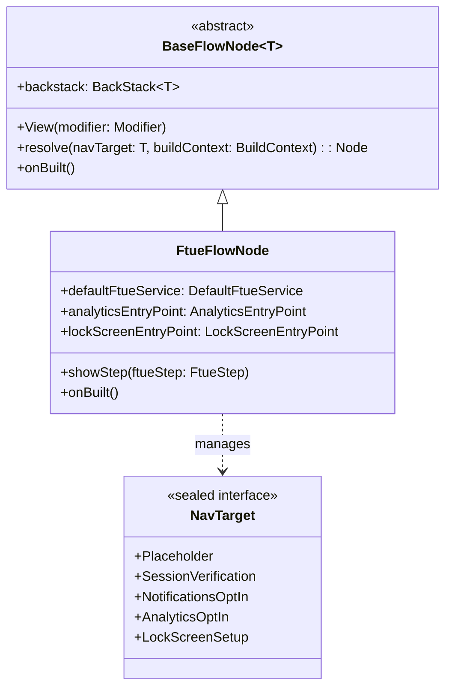
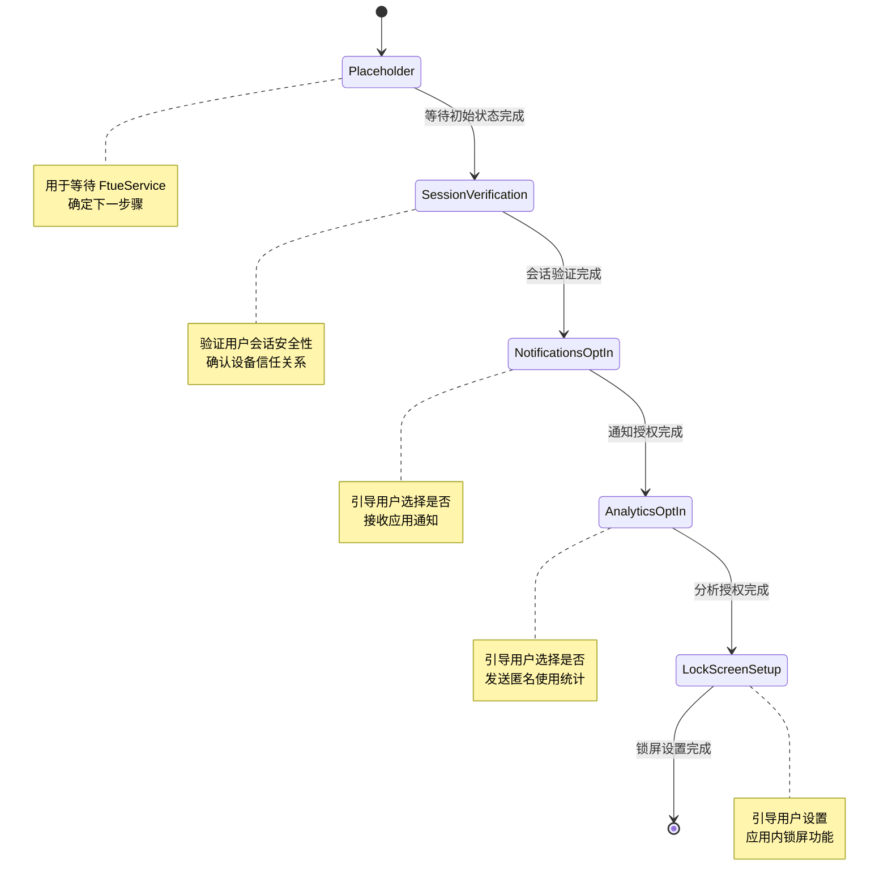
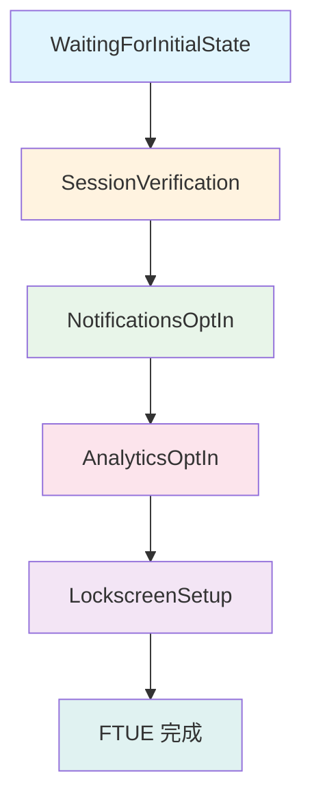
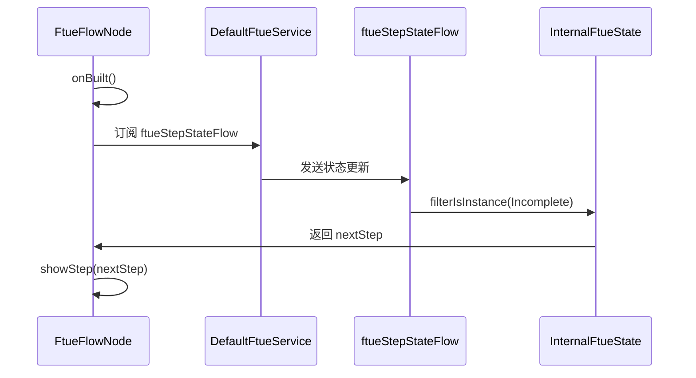
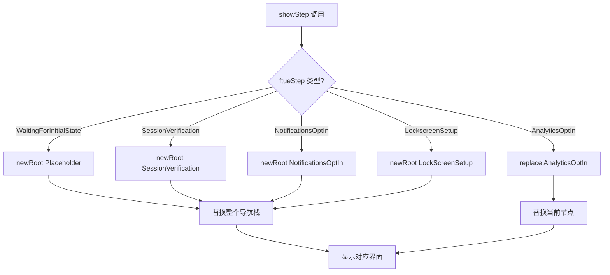
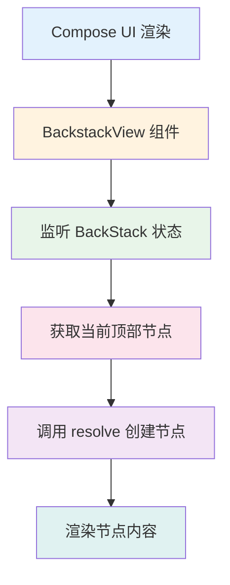
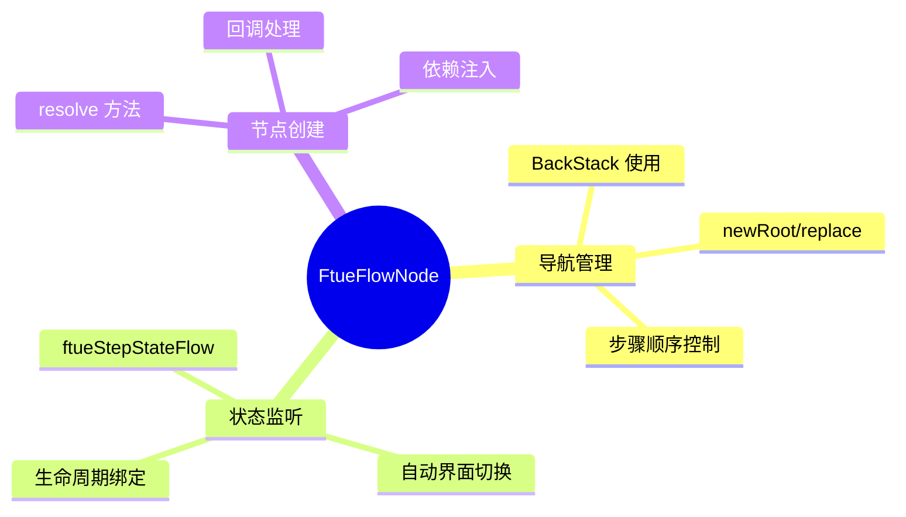

# FtueFlowNode 首次用户体验引导流程

## 演示文稿

---

# 目录

1. [FTUE 概述与背景](#概述)
2. [FtueFlowNode 核心架构](#架构)
3. [导航目标详解](#导航目标)
4. [状态管理与流程控制](#状态管理)
5. [代码实现深度解析](#代码解析)
6. [总结与关键点](#总结)

---

# 1. FTUE 概述与背景

## 什么是 FTUE？

**FTUE** = First Time User Experience（首次用户体验）

是指用户**第一次**使用应用时，引导用户熟悉产品核心功能的流程。

## 为什么需要 FTUE？

- 帮助用户快速上手
- 提升用户留存率
- 确保关键功能被用户知晓
- 收集必要的用户权限（通知、分析等）

## Element Android 中的 FTUE 流程

在 Element（Matrix 协议的即时通讯应用）中，FTUE 包含以下步骤：

1. 会话验证 - 确认设备安全
2. 通知授权 - 允许消息推送
3. 分析授权 - 帮助改进产品
4. 锁屏设置 - 保护隐私

---

# 2. FtueFlowNode 核心架构

## 类结构概览



## 核心职责

| 职责 | 描述 |
|------|------|
| 导航管理 | 使用 BackStack 管理引导步骤的流转 |
| 状态监听 | 监听 FtueService 状态，自动切换界面 |
| 节点创建 | 根据导航目标创建对应的子节点 |
| 回调处理 | 处理各步骤完成后的回调 |

## 技术栈

- **Appyx 框架**：声明式导航框架
- **Jetpack Compose**：UI 渲染
- **Kotlin Coroutines**：异步流处理
- **Hilt/Dagger**：依赖注入

---

# 3. 导航目标详解

## NavTarget 密封接口



## 各导航目标详情

### Placeholder（占位符）

```kotlin
@Parcelize
data object Placeholder : NavTarget
```

**用途**：
- 引导流程初始化阶段
- 显示空白界面
- 等待 FtueService 确定下一步骤

**对应节点**：`emptyNode(buildContext)`

### SessionVerification（会话验证）

```kotlin
@Parcelize
data object SessionVerification : NavTarget
```

**用途**：
- 用户完成登录后验证会话
- 确认设备信任关系
- 防止中间人攻击

**对应节点**：`FtueSessionVerificationFlowNode`

**回调处理**：
```kotlin
val callback = object : FtueSessionVerificationFlowNode.Callback {
    override fun onDone() {
        defaultFtueService.onUserCompletedSessionVerification()
    }
}
```

### NotificationsOptIn（通知授权）

```kotlin
@Parcelize
data object NotificationsOptIn : NavTarget
```

**用途**：
- 引导用户选择是否接收通知
- 提高消息触达率

**对应节点**：`NotificationsOptInNode`

**回调处理**：
```kotlin
val callback = object : NotificationsOptInNode.Callback {
    override fun onNotificationsOptInFinished() {
        defaultFtueService.updateFtueStep()
    }
}
```

### AnalyticsOptIn（分析授权）

```kotlin
@Parcelize
data object AnalyticsOptIn : NavTarget
```

**用途**：
- 引导用户选择是否发送匿名统计
- 帮助改进产品体验

**特点**：使用 `replace` 操作，允许返回修改

### LockScreenSetup（锁屏设置）

```kotlin
@Parcelize
data object LockScreenSetup : NavTarget
```

**用途**：
- 引导用户设置锁屏功能
- 增强隐私保护

**对应节点**：`LockScreenEntryPoint`

**回调处理**：
```kotlin
val callback = object : LockScreenEntryPoint.Callback {
    override fun onSetupDone() {
        defaultFtueService.updateFtueStep()
    }
}
```

---

# 4. 状态管理与流程控制

## FtueStep 枚举状态



## 状态监听机制

### onBuilt() 方法



## 状态流转代码

```kotlin
override fun onBuilt() {
    super.onBuilt()
    defaultFtueService.ftueStepStateFlow
        .filterIsInstance(InternalFtueState.Incomplete::class)
        .onEach {
            showStep(it.nextStep)
        }
        .launchIn(lifecycleScope)
}
```

### 关键点解析

| 步骤 | 说明 |
|------|------|
| `filterIsInstance<InternalFtueState.Incomplete>` | 只关心未完成状态 |
| `onEach` | 对每个状态执行操作 |
| `launchIn(lifecycleScope)` | 在生命周期内自动收集 |

## 步骤显示方法



---

# 5. 代码实现深度解析

## 构造函数分析

```kotlin
@ContributesNode(SessionScope::class)
@AssistedInject
class FtueFlowNode(
    @Assisted buildContext: BuildContext,
    @Assisted plugins: List<Plugin>,
    private val defaultFtueService: DefaultFtueService,
    private val analyticsEntryPoint: AnalyticsEntryPoint,
    private val lockScreenEntryPoint: LockScreenEntryPoint,
) : BaseFlowNode<FtueFlowNode.NavTarget>(
    backstack = BackStack(
        initialElement = NavTarget.Placeholder,
        savedStateMap = buildContext.savedStateMap,
    ),
    buildContext = buildContext,
    plugins = plugins,
)
```

### 依赖注入说明

| 依赖项 | 用途 | 作用域 |
|--------|------|--------|
| `defaultFtueService` | 管理 FTUE 步骤状态 | SessionScope |
| `analyticsEntryPoint` | 创建分析授权界面 | SessionScope |
| `lockScreenEntryPoint` | 创建锁屏设置界面 | SessionScope |

### @ContributesNode 注解

- 由 Hilt 提供
- 将节点注册到 `SessionScope` 生命周期
- 确保节点与用户会话共存亡

## 节点解析方法详解

```kotlin
override fun resolve(navTarget: NavTarget, buildContext: BuildContext): Node {
    return when (navTarget) {
        NavTarget.Placeholder -> {
            emptyNode(buildContext)
        }
        is NavTarget.SessionVerification -> {
            val callback = object : FtueSessionVerificationFlowNode.Callback {
                override fun onDone() {
                    defaultFtueService.onUserCompletedSessionVerification()
                }
            }
            createNode<FtueSessionVerificationFlowNode>(buildContext, listOf(callback))
        }
        NavTarget.NotificationsOptIn -> {
            val callback = object : NotificationsOptInNode.Callback {
                override fun onNotificationsOptInFinished() {
                    defaultFtueService.updateFtueStep()
                }
            }
            createNode<NotificationsOptInNode>(buildContext, listOf(callback))
        }
        NavTarget.AnalyticsOptIn -> {
            analyticsEntryPoint.createNode(this, buildContext)
        }
        NavTarget.LockScreenSetup -> {
            val callback = object : LockScreenEntryPoint.Callback {
                override fun onSetupDone() {
                    defaultFtueService.updateFtueStep()
                }
            }
            lockScreenEntryPoint.createNode(
                parentNode = this,
                buildContext = buildContext,
                navTarget = LockScreenEntryPoint.Target.Setup,
                callback = callback,
            )
        }
    }
}
```

### 节点创建模式

| 导航目标 | 创建方式 | 回调类型 |
|----------|----------|----------|
| Placeholder | `emptyNode()` | 无 |
| SessionVerification | `createNode<>()` | FtueSessionVerificationFlowNode.Callback |
| NotificationsOptIn | `createNode<>()` | NotificationsOptInNode.Callback |
| AnalyticsOptIn | `entryPoint.createNode()` | 内置 |
| LockScreenSetup | `entryPoint.createNode()` | LockScreenEntryPoint.Callback |

## 导航栈操作对比

```kotlin
private fun showStep(ftueStep: FtueStep) {
    when (ftueStep) {
        FtueStep.WaitingForInitialState -> {
            backstack.newRoot(NavTarget.Placeholder)
        }
        FtueStep.SessionVerification -> {
            backstack.newRoot(NavTarget.SessionVerification)
        }
        FtueStep.NotificationsOptIn -> {
            backstack.newRoot(NavTarget.NotificationsOptIn)
        }
        FtueStep.AnalyticsOptIn -> {
            backstack.replace(NavTarget.AnalyticsOptIn)  // 特殊处理
        }
        FtueStep.LockscreenSetup -> {
            backstack.newRoot(NavTarget.LockScreenSetup)
        }
    }
}
```

### newRoot vs replace

| 操作 | 效果 | 适用场景 |
|------|------|----------|
| `newRoot` | 替换整个导航栈 | 线性流程，不能返回 |
| `replace` | 替换当前节点 | 允许返回修改 |

**为什么 AnalyticsOptIn 使用 replace？**

- 用户可能需要重新考虑分析授权选项
- 使用 replace 可以保留返回路径
- 其他步骤按顺序完成即可，无需返回

## UI 渲染

```kotlin
@Composable
override fun View(modifier: Modifier) {
    BackstackView()
}
```

### 渲染流程



---

# 6. 总结与关键点

## 核心概念回顾

### FtueFlowNode 的三大职责



## 关键代码片段速查

### 状态监听
```kotlin
defaultFtueService.ftueStepStateFlow
    .filterIsInstance(InternalFtueState.Incomplete::class)
    .onEach { showStep(it.nextStep) }
    .launchIn(lifecycleScope)
```

### 步骤显示
```kotlin
backstack.newRoot(NavTarget.xxx)  // 大多数步骤
backstack.replace(NavTarget.AnalyticsOptIn)  // 分析授权
```

### 节点创建
```kotlin
createNode<FtueSessionVerificationFlowNode>(buildContext, listOf(callback))
analyticsEntryPoint.createNode(this, buildContext)
lockScreenEntryPoint.createNode(parentNode, buildContext, navTarget, callback)
```

## 学习建议

1. **先理解导航模式**：Appyx 框架的 BackStack 概念
2. **再看状态管理**：FtueService 如何控制流程
3. **最后看具体实现**：每个步骤节点的内部逻辑

## 扩展阅读

- [Appyx 框架文档](https://bumble-tech.github.io/appyx/)
- [Jetpack Compose 导航](https://developer.android.com/jetpack/compose/navigation)
- [Hilt 依赖注入](https://dagger.dev/hilt/)

---

# 结束

感谢您的观看！

如有任何问题，请随时提问。

---

## 附录：完整代码结构

```
FtueFlowNode.kt
├── 包声明
├── 类文档注释
├── 导入语句
├── @ContributesNode 注解
├── @AssistedInject 构造函数
│   └── 依赖注入参数
├── NavTarget 密封接口
│   ├── Placeholder
│   ├── SessionVerification
│   ├── NotificationsOptIn
│   ├── AnalyticsOptIn
│   └── LockScreenSetup
├── onBuilt() 方法
├── resolve() 方法
├── showStep() 方法
└── View() 方法
```


