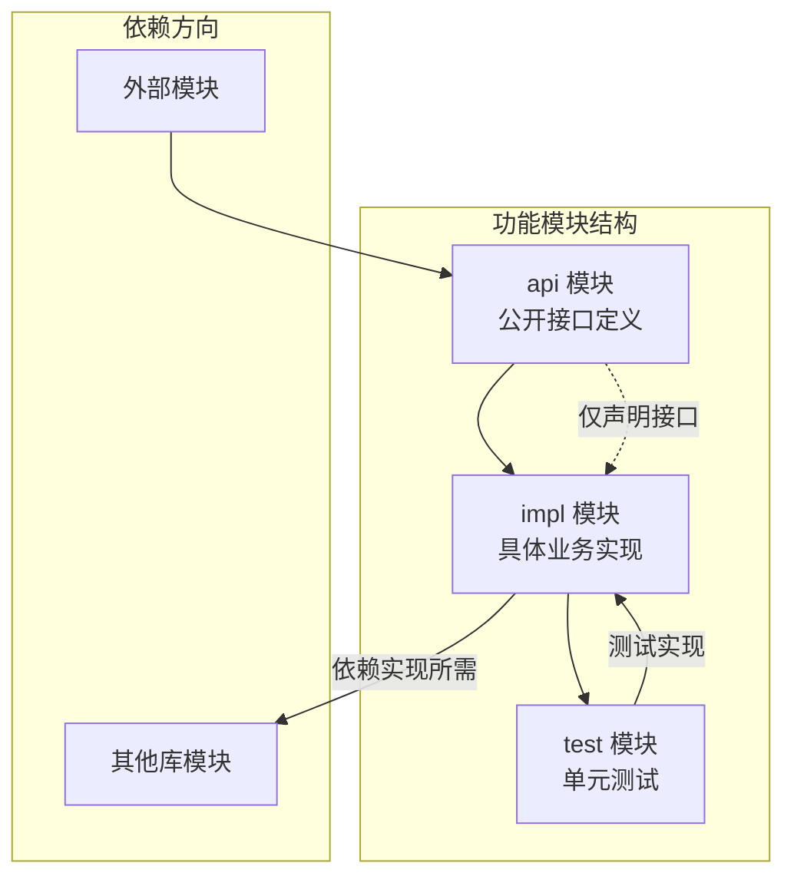
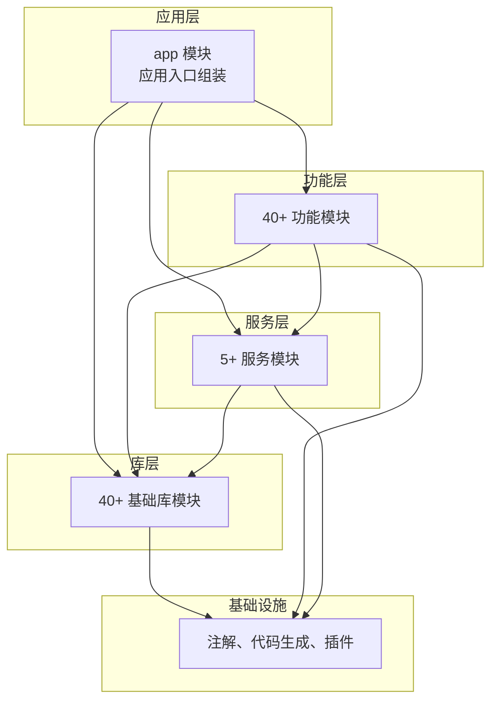
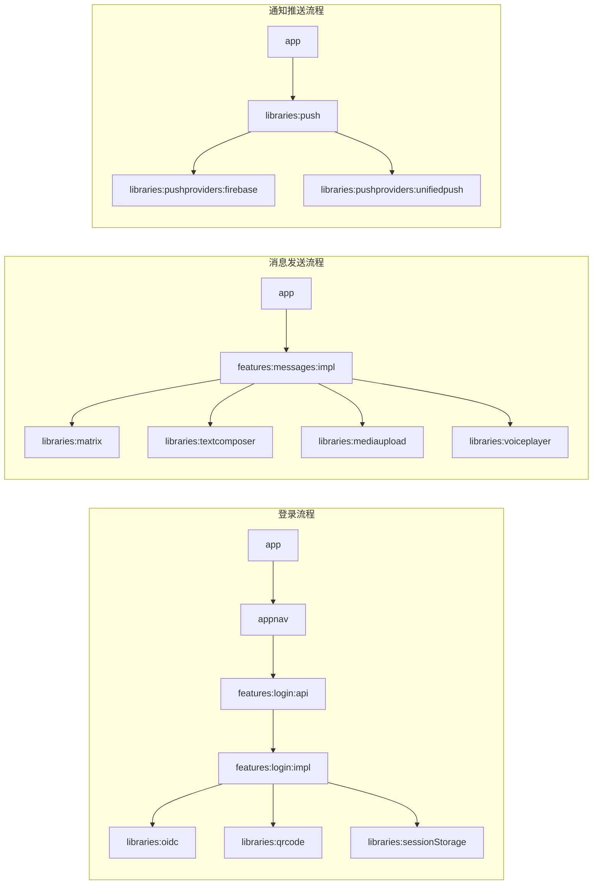

# Element X Android 模块依赖关系分析文档

## 一、项目概述

Element X Android 是 Element 公司基于 Matrix 协议开发的下一代即时通讯客户端应用。作为 Element Classic 的完全重写版本，该项目采用了现代化的 Android 开发技术栈，体现了当代移动应用开发的最佳实践。项目遵循严格的模块化架构设计，将复杂的即时通讯功能拆分为多个独立的、可组合的模块，既保证了代码的可维护性，又为功能的灵活扩展提供了坚实的基础。

本项目的技术栈选择体现了对现代 Android 开发的深入理解。底层采用 Matrix Rust SDK，通过 FFI 层与 Kotlin 代码进行交互，实现了跨平台代码共享和性能优化。UI 层完全采用 Jetpack Compose 构建，摒弃了传统的 XML 布局方式，使得 UI 代码更加简洁和声明式。导航架构选择 Appyx 框架，这是一个专为 Compose 设计的声明式导航库，提供了比传统导航组件更加灵活和强大的导航能力。开发语言以 Kotlin 为主，充分利用了其现代语言特性，如协程、密封类、扩展函数等，提高了代码的表达力和安全性。

项目的模块化架构是其核心竞争力之一。整个应用被分解为超过 80 个独立模块，涵盖应用入口、功能实现、基础库支撑、服务抽象等多个层面。这种高度模块化的设计带来了多方面的好处：首先，不同模块可以由不同的开发团队并行开发，提高了开发效率；其次，模块间的清晰边界使得单元测试和集成测试更加容易实施；第三，模块化的设计使得功能可以根据需求进行灵活组合和裁剪，适应不同的部署场景；最后，模块化的代码结构有利于代码复用，可以在多个项目中共享相同的模块。

## 二、模块目录结构

### 2.1 核心应用模块

核心应用模块构成了应用的基础骨架，位于项目根目录下，直接参与应用的构建过程。这些模块提供了应用运行所必需的核心功能，是整个应用的入口点和控制中心。

```
element-x-android/
├── app/                          # 主应用模块，包含 Application 类和入口点
├── appnav/                       # 应用导航模块，管理应用的整体导航结构
├── appconfig/                    # 应用配置模块，提供应用级别的配置信息
├── annotations/                  # 注解模块，自定义编译时注解
├── codegen/                      # 代码生成模块，用于生成绑定代码
└── plugins/                      # Gradle 构建插件
```

主应用模块（app）是整个项目的核心，它依赖于所有其他功能模块、库模块和服务模块，形成了一个完整的依赖树。这个模块包含了 Application 类、主题配置、资源文件以及应用级别的组装逻辑。主模块负责初始化依赖注入框架、配置应用级别的设置、组装各个功能模块、选择合适的构建变体等关键任务。主模块本身不包含太多的业务逻辑，它的主要职责是将各个独立的模块连接在一起，形成一个完整的应用程序。

应用导航模块（appnav）负责管理应用的整个导航结构，使用 Appyx 框架实现复杂的导航场景。这个模块定义了用户在不同状态之间的流转路径，包括登录前流程、登录后主流程、设置流程等。导航模块是连接各个功能模块的枢纽，它需要了解并协调多个模块的导航入口，确保用户能够顺畅地在不同的功能之间切换。导航模块的设计遵循关注点分离原则，它本身不包含业务逻辑，只是负责协调各个功能模块的展示时机和方式。

应用配置模块（appconfig）封装了各种构建时和运行时的配置参数，为其他模块提供统一的配置访问接口。这个模块包含了应用的基础配置、认证配置、推送配置、消息编辑器配置、通知配置等各类设置项。通过集中管理配置信息，项目实现了配置与代码的分离，使得调整应用行为变得更加灵活和可控。

### 2.2 功能模块目录

功能模块按照功能域进行组织，每个功能域都包含一组相关的业务逻辑。features 目录下的模块遵循统一的目录结构，通常包括 API 定义、实现和测试三个部分，体现了清晰的关注点分离。

```
features/
├── analytics/                   # 用户行为分析
├── announcement/                # 公告功能
├── cachecleaner/                # 缓存清理
├── call/                        # 视频语音通话
├── createroom/                  # 创建房间
├── deactivation/                # 账户停用
├── enterprise/                  # 企业功能
├── forward/                      # 消息转发
├── ftue/                        # 首次用户体验
├── home/                        # 首页房间列表
├── invite/                       # 邀请用户
├── invitepeople/                # 邀请人员
├── joinroom/                    # 加入房间
├── knockrequests/               # 敲门请求
├── leaveroom/                   # 离开房间
├── licenses/                    # 许可证信息
├── linknewdevice/              # 链接新设备
├── location/                   # 位置共享
├── lockscreen/                  # 锁屏功能
├── login/                       # 用户登录认证
├── logout/                      # 退出登录
├── messages/                    # 消息时间线聊天
├── migration/                  # 数据迁移
├── networkmonitor/              # 网络监控
├── poll/                        # 投票功能
├── preferences/                 # 应用设置
├── rageshake/                   # 崩溃报告
├── reportroom/                  # 举报房间
├── rolesandpermissions/         # 角色权限
├── roomaliasresolver/           # 房间别名解析
├── roomcall/                    # 房间通话
├── roomdetails/                 # 房间信息设置
├── roomdetailsedit/             # 编辑房间详情
├── roomdirectory/               # 房间目录
├── roommembermoderation/        # 房间成员管理
├── securebackup/               # 安全备份
├── securityandprivacy/         # 安全隐私设置
├── share/                       # 分享功能
├── signedout/                   # 退出登录界面
├── space/                       # 空间功能
├── startchat/                   # 开始聊天
├── userprofile/                 # 用户资料
├── verifysession/              # 会话验证
└── viewfolder/                  # 文件查看
```

功能模块的完整列表涵盖了即时通讯应用的核心功能。用户认证相关的模块包括登录（login）、注销（logout）、验证会话（verifysession）和锁定屏幕（lockscreen）等，这些模块共同构成了用户身份认证和会话管理的完整体系。房间相关模块涵盖了创建房间（createroom）、加入房间（joinroom）、离开房间（leaveroom）、房间详情（roomdetails）、房间编辑（roomdetailsedit）、房间目录（roomdirectory）、房间呼叫（roomcall）、房间别名解析（roomaliasresolver）以及房间成员管理（roommembermoderation）等，覆盖了房间生命周期的各个环节。

消息模块是应用的核心功能之一，包括消息列表与聊天界面（messages）、投票功能（poll）、位置共享（location）等子模块。这些模块负责消息的展示、发送、接收和处理，是用户日常使用最频繁的功能。媒体功能模块包括媒体查看（mediaviewer）、媒体上传（mediaupload）、媒体选择（mediapickers）、语音录制（voicerecorder）和语音播放（voiceplayer）等，为消息功能提供了丰富的多媒体支持。

安全与隐私相关的模块包括安全备份（securebackup）、安全与隐私设置（securityandprivacy）、账户停用（deactivation）等，这些模块保护用户数据的安全和隐私。企业功能模块包括企业功能入口（enterprise）、角色与权限（rolesandpermissions）、房间成员管理（roommembermoderation）等，为企业用户提供了高级的管理功能。

### 2.3 库模块目录

库模块提供了可复用的基础组件和技术支撑，被功能模块和服务模块所依赖。这些模块按照技术领域进行划分，涵盖了架构组件、UI 组件、数据处理、网络通信、安全加密等多个方面，是整个应用的技术基石。

```
libraries/
├── accountselect/               # 账户选择器
├── androidutils/               # Android 平台工具类
├── architecture/               # 基础架构组件
├── audio/                      # 音频处理
├── compound/                   # Compound 设计系统
├── core/                       # 核心工具类
├── cryptography/               # 加密解密功能
├── dateformatter/              # 日期格式化
├── deeplink/                   # 深度链接处理
├── designsystem/               # 设计系统组件
├── di/                         # 依赖注入
├── encrypted-db/               # 加密数据库
├── eventformatter/             # Matrix 事件格式化
├── featureflag/               # 功能开关管理
├── fullscreenintent/           # 全屏 Intent 支持
├── indicator/                  # 指示器组件
├── maplibre-compose/           # MapLibre 地图 Compose 集成
├── matrix/                      # Matrix 协议核心实现
├── matrixmedia/                # 媒体处理相关组件
├── matrixui/                   # Matrix 相关的 UI 组件
├── mediapickers/               # 媒体选择器
├── mediaplayer/                # 媒体播放
├── mediaupload/                # 媒体上传处理
├── mediaviewer/                # 媒体查看器
├── network/                    # 网络层封装
├── oidc/                       # OpenID Connect 认证支持
├── permissions/                # 运行时权限管理
├── preferences/                # 用户偏好设置存储
├── push/                       # 推送通知处理
├── pushproviders/              # 推送服务提供商
├── pushstore/                 # 推送存储
├── qrcode/                     # 二维码处理
├── recentemojis/               # 最近使用表情
├── roomselect/                 # 房间选择器
├── rustsdk/                   # Rust SDK 绑定
├── session-storage/            # 会话数据存储
├── testtags/                   # 测试标签
├── textcomposer/               # 文本编辑组件
├── troubleshoot/               # 问题诊断
├── ui-common/                  # 通用 UI 工具
├── ui-strings/                 # 国际化字符串资源
├── ui-utils/                   # UI 工具类
├── usersearch/                 # 用户搜索
├── voicerecorder/              # 语音录制
├── voiceplayer/                # 语音播放
├── wellknown/                  # .well-known 协议支持
└── workmanager/                # WorkManager 封装
```

库模块的设计遵循单一职责原则，每个模块专注于特定的功能领域。architecture 模块定义了应用的基础架构模式，包括节点（Node）、流程（Flow）、插件（Plugin）、呈现器（Presenter）等核心抽象，为其他模块提供统一的架构支撑。matrix 模块封装了 Matrix 协议的客户端实现，包括房间同步、消息发送、用户认证等核心功能，是整个应用与 Matrix 服务器通信的基础。designsystem 模块提供了丰富的 UI 组件，包括按钮、输入框、对话框、主题等通用设计元素，确保了应用视觉体验的一致性。

### 2.4 服务模块目录

服务模块提供跨功能的通用服务，通常与特定的技术栈或外部服务相关联。这些模块被多个功能模块所共享，提供了一致的接口抽象，体现了 DRY（Don't Repeat Yourself）原则。

```
services/
├── analytics/                   # 用户行为分析服务
│   ├── api/                    # 分析服务接口定义
│   ├── impl/                   # 分析服务实现
│   ├── compose/                # Compose 相关的分析组件
│   ├── noop/                   # 空实现（用于禁用分析时）
│   └── test/                   # 测试支持
├── analyticsproviders/          # 分析服务提供商
│   ├── api/                    # 提供商接口
│   ├── posthog/               # PostHog 实现
│   ├── sentry/                # Sentry 实现
│   └── test/                  # 测试支持
├── apperror/                   # 应用错误处理
│   ├── api/                   # 错误处理接口
│   ├── impl/                  # 错误处理实现
│   └── test/                  # 测试支持
├── appnavstate/               # 应用导航状态
│   ├── api/                   # 导航状态接口
│   ├── impl/                  # 导航状态实现
│   └── test/                  # 测试支持
└── toolbox/                   # 工具箱服务
    ├── api/                   # 工具箱接口
    ├── impl/                  # 工具箱实现
    └── test/                  # 测试支持
```

服务模块采用了策略模式的设计，允许在运行时切换不同的实现。分析服务（analytics）提供了完整的分析功能追踪用户行为，同时也提供了 noop（空实现）作为替代，当分析功能被禁用时，系统会自动使用空实现来避免无效的依赖。分析服务提供商（analyticsproviders）支持 PostHog 和 Sentry 两种实现，可以根据需求进行选择和配置。导航状态服务（appnavstate）管理应用的导航状态，确保应用在不同状态之间切换时能够正确恢复和保存状态。

## 三、依赖关系架构模式

### 3.1 标准模块三层结构

项目中的每个功能模块和库模块都遵循统一的三层结构模式：API 层（api）、实现层（impl）和测试层（test）。这种模式源自 Android 社区的最佳实践，有助于明确模块的公共接口和内部实现之间的边界，提高代码的可维护性和可测试性。



API 层（api）定义了模块对外暴露的接口和类型，是其他模块依赖该模块时的入口点。这一层应该保持最小化，只包含必要的公开接口、数据类、异常类型等。API 层的依赖关系应该尽量简洁，通常只依赖于更底层的架构库或基础类型库。以登录模块为例，其 API 层仅依赖于 architecture 库，定义了登录入口点（LoginEntryPoint）和回调接口，这些就是外部模块与登录功能交互的全部契约。

实现层（impl）包含了模块的具体业务逻辑实现，它依赖于自己的 API 层以及完成功能所需的其他库模块。这种依赖关系确保了实现细节不会泄漏到模块外部，其他模块只能通过 API 层定义的接口与该模块交互。实现层通常还会依赖于一些 Android 平台库、Compose 库、第三方库等来辅助实现功能。登录模块的实现层除了依赖 API 层外，还需要依赖设计系统库（用于 UI）、权限库（用于请求权限）、二维码库（用于二维码登录）等。

测试层（test）包含了模块的单元测试和集成测试，它依赖于实现层和相关的测试工具库。测试依赖通常标记为 testImplementation，确保它们不会泄漏到生产代码中。项目使用了多种测试工具和框架，包括 JUnit、MockK、Turbine、Coroutines Test 等，用于不同层次的测试需求。

### 3.2 依赖方向与层次

模块间的依赖关系形成了清晰的层次结构，这种分层设计是模块化架构的核心。从依赖方向来看，API 层处于最底层，被实现层所依赖；实现层处于中间层，既依赖 API 层也依赖各种库模块；应用模块处于最顶层，依赖于所有功能模块和库模块。



这种层次化的依赖结构确保了模块间的清晰边界。上层模块可以依赖下层模块，但下层模块不应该知道上层模块的存在。这种设计使得各个模块可以独立开发、测试和部署，降低了模块间的耦合度，提高了代码的可维护性。例如，登录功能模块不需要知道它是被主应用模块使用还是被测试工具使用，它只需要专注于提供正确的登录功能即可。

库模块之间也存在依赖关系，但这种依赖通常也是单向的且遵循同样的层次原则。基础性的库（如 architecture、core、di）通常不依赖其他库，或者只依赖更基础的系统库。功能性的库（如 designsystem、matrix、push）则会依赖基础库来构建更复杂的功能。这种分层的库依赖结构确保了系统的稳定性和可维护性。

### 3.3 跨模块依赖模式

在实际的业务场景中，功能模块之间往往存在相互依赖的关系。项目采用了多种模式来管理这些复杂的依赖关系，每种模式都有其适用场景和优缺点。

第一种模式是通过 API 层进行依赖。当一个模块需要使用另一个模块的功能时，它应该依赖于目标模块的 API 层，而不是实现层。这种方式确保了依赖关系的稳定性，即使实现层发生变化，只要 API 层保持兼容，就不需要修改依赖方代码。例如，appnav 模块依赖于 features:login:api 来获取登录入口点，而不是直接依赖于实现层。这种模式的核心思想是面向接口编程，而非面向实现编程。

```gradle
// appnav 模块的依赖配置示例
dependencies {
    // 依赖于 login 模块的 API 层
    implementation(projects.features.login.api)
    
    // 依赖于其他功能模块的 API 层
    implementation(projects.features.announcement.api)
    implementation(projects.features.ftue.api)
    implementation(projects.features.share.api)
}
```

第二种模式是使用功能开关（Feature Flag）。某些模块可能只在特定条件下才会被使用，例如企业版特性或实验性功能。这些模块的依赖被包裹在条件判断中，只有满足特定条件时才会被包含到构建中。这种模式在 app/build.gradle.kts 中体现，通过条件判断来选择引入企业版还是开源版的组件。

```gradle
dependencies {
    if (isEnterpriseBuild) {
        allEnterpriseImpl(project)
        implementation(projects.appicon.enterprise)
    } else {
        implementation(projects.features.enterprise.implFoss)
        implementation(projects.appicon.element)
    }
}
```

第三种模式是服务定位模式。对于某些可选的或可替换的服务，项目使用服务定位器来获取服务实例，而不是通过构造器注入。这种模式允许在运行时决定使用哪种实现，提高了灵活性。分析服务的 noop 实现就是这种模式的典型应用，当分析功能被禁用时，系统会使用空实现来替代真实实现，而调用方代码无需感知这种变化。

第四种模式是路由模式。对于导航相关的依赖，模块不直接依赖其他模块，而是通过导航路由器（Navigator）或路由配置来间接依赖。这种模式进一步降低了模块间的耦合度，因为模块只需要知道路由标识符，而不需要知道目标模块的具体类型。

## 四、关键模块依赖详解

### 4.1 应用入口模块依赖分析

应用模块（app）是整个项目的核心入口，它依赖于所有功能模块、库模块和服务模块，形成了一个完整的依赖图。这个模块负责组装所有组件、初始化依赖注入框架、配置应用级别的设置、选择合适的构建变体等关键任务。

```gradle
dependencies {
    // 引入所有库模块的实现
    allLibrariesImpl()
    
    // 引入所有服务模块的实现
    allServicesImpl()
    
    // 根据构建类型引入功能模块
    allFeaturesImpl(project)
    
    // 企业版特殊处理
    if (isEnterpriseBuild) {
        allEnterpriseImpl(project)
        implementation(projects.appicon.enterprise)
    } else {
        implementation(projects.features.enterprise.implFoss)
        implementation(projects.appicon.element)
    }
    
    // 导航和配置模块
    implementation(projects.appnav)
    implementation(projects.appconfig)
    
    // 通用资源
    implementation(projects.libraries.uiStrings)
    implementation(projects.services.analytics.compose)
    
    // 推送服务配置
    if (ModulesConfig.pushProvidersConfig.includeFirebase) {
        "gplayImplementation"(projects.libraries.pushproviders.firebase)
    }
    if (ModulesConfig.pushProvidersConfig.includeUnifiedPush) {
        implementation(projects.libraries.pushproviders.unifiedpush)
    }
    
    // 第三方库
    implementation(libs.appyx.core)
    implementation(libs.androidx.splash)
    implementation(libs.androidx.core)
    implementation(libs.androidx.corektx)
    implementation(libs.androidx.lifecycle.runtime)
    implementation(libs.androidx.lifecycle.process)
    implementation(libs.androidx.activity.compose)
    implementation(libs.androidx.startup)
    implementation(libs.androidx.preference)
    implementation(libs.coil)
    
    // 网络和序列化
    implementation(platform(libs.network.okhttp.bom))
    implementation(libs.network.okhttp.logging)
    implementation(libs.serialization.json)
    
    // Matrix 相关
    implementation(libs.matrix.emojibase.bindings)
}
```

应用模块的依赖配置体现了几个重要的设计原则。首先是选择性引入原则，通过 allLibrariesImpl()、allServicesImpl() 和 allFeaturesImpl() 三个函数，项目可以灵活地控制引入哪些模块，而不是在 settings.gradle.kts 中硬编码所有模块的依赖。这种方式比直接列出所有模块更加灵活，因为可以在配置层面控制模块的包含与否，也便于后续添加或移除模块。

其次是条件编译原则，企业版和开源版使用不同的组件，通过 isEnterpriseBuild 标志来切换。这种设计允许从同一代码库构建不同版本的应用程序，既满足了开源社区的需求，也满足了企业客户对特定功能的需求。类似的条件编译还应用于推送服务的选择，Firebase 推送只在 Google Play 版本中引入，而 UnifiedPush 则在所有版本中可用。

### 4.2 导航模块依赖分析

导航模块（appnav）管理着应用的整个导航结构，包括登录前流程、登录后主流程、设置流程等。这个模块是连接各个功能模块的枢纽，需要了解并协调多个模块的导航入口。

```gradle
dependencies {
    // 核心依赖
    implementation(projects.libraries.core)
    implementation(projects.libraries.androidutils)
    implementation(projects.libraries.architecture)
    implementation(projects.libraries.deeplink.api)
    implementation(projects.libraries.featureflag.api)
    
    // Matrix 相关
    implementation(projects.libraries.matrix.api)
    implementation(projects.libraries.matrixui)
    implementation(projects.libraries.matrixmedia.api)
    implementation(projects.libraries.oidc.api)
    implementation(projects.libraries.preferences.api)
    implementation(projects.libraries.push.api)
    implementation(projects.libraries.pushproviders.api)
    
    // 设计系统
    implementation(projects.libraries.designsystem)
    
    // 通用组件
    implementation(projects.libraries.uiCommon)
    implementation(projects.libraries.uiStrings)
    
    // 功能模块 API
    implementation(projects.features.login.api)
    implementation(projects.features.announcement.api)
    implementation(projects.features.ftue.api)
    implementation(projects.features.linknewdevice.api)
    implementation(projects.features.share.api)
    
    // 服务模块
    implementation(projects.services.apperror.impl)
    implementation(projects.services.appnavstate.api)
    implementation(projects.services.analytics.api)
    
    // 第三方库
    implementation(libs.coil)
}
```

导航模块的依赖结构展示了协调型模块的特点。它本身不包含业务逻辑，主要职责是协调其他模块的导航交互。因此，它依赖于多个功能模块的 API 层，通过这些 API 获取创建和管理功能节点的入口点。导航模块使用 Appyx 框架提供的导航能力，结合各个功能模块的入口点，构建出完整的应用导航流程。

### 4.3 功能模块依赖示例

以登录模块（login）为例，展示功能模块的典型依赖结构。登录模块是用户进入应用的第一步，它需要处理用户认证、SSO 登录、二维码扫描等多种场景，因此依赖于多个底层库的支持。

```gradle
// features:login:api 的依赖配置
plugins {
    id("io.element.android-library")
    id("kotlin-parcelize")
}

android {
    namespace = "io.element.android.features.login.api"
}

dependencies {
    implementation(projects.libraries.architecture)
}

// features:login:impl 的依赖配置
plugins {
    id("io.element.android-compose-library")
    id("kotlin-parcelize")
    alias(libs.plugins.kotlin.serialization)
}

android {
    namespace = "io.element.android.features.login.impl"
}

dependencies {
    implementation(projects.appconfig)
    implementation(projects.features.enterprise.api)
    implementation(projects.features.rageshake.api)
    
    // 基础库
    implementation(projects.libraries.core)
    implementation(projects.libraries.androidutils)
    implementation(projects.libraries.architecture)
    implementation(projects.libraries.matrix.api)
    implementation(projects.libraries.designsystem)
    
    // 功能支持库
    implementation(projects.libraries.featureflag.api)
    implementation(projects.libraries.permissions.api)
    implementation(projects.libraries.sessionStorage.api)
    implementation(projects.libraries.oidc.api)
    implementation(projects.libraries.qrcode)
    implementation(projects.libraries.wellknown.api)
    
    // 第三方库
    implementation(libs.androidx.browser)
    implementation(libs.androidx.webkit)
    implementation(libs.serialization.json)
    
    // 公开 API
    api(projects.features.login.api)
}
```

登录模块的依赖结构展示了功能模块的典型特征。API 层仅依赖于 architecture 库，保持了最小化的接口定义。实现层则需要依赖更多的支撑库：appconfig 用于获取配置信息，enterprise.api 用于企业版功能，rageshake.api 用于错误报告。基础库包括 core、androidutils、architecture、matrix 等，提供了节点生命周期管理、平台工具、Matrix 通信等核心能力。功能支持库包括权限管理、会话存储、OIDC 认证、二维码处理等，支撑登录功能的各个子功能。

### 4.4 库模块依赖示例

库模块的依赖通常更加底层和通用。以设计系统库（designsystem）为例，它定义了应用使用的所有通用 UI 组件，是几乎所有功能模块都会依赖的基础库。

```gradle
plugins {
    id("io.element.android-compose-library")
    alias(libs.plugins.ksp)
    id("kotlin-parcelize")
}

android {
    namespace = "io.element.android.libraries.designsystem"
    
    buildFeatures {
        buildConfig = true
    }
}

dependencies {
    // 依赖 Compound 设计系统
    api(projects.libraries.compound)
    
    // Compose 相关
    implementation(libs.androidx.compose.material3.windowsizeclass)
    implementation(libs.androidx.compose.material3.adaptive)
    implementation(libs.coil.compose)
    implementation(libs.vanniktech.blurhash)
    
    // 内部库依赖
    implementation(projects.libraries.androidutils)
    implementation(projects.libraries.architecture)
    implementation(projects.libraries.core)
    implementation(projects.libraries.preferences.api)
    implementation(projects.libraries.testtags)
    implementation(projects.libraries.uiStrings)
    
    // 代码生成和文档
    ksp(libs.showkase.processor)
    implementation(libs.showkase)
    
   
}
```

设计系统库的特点是依赖相对简单，主要依赖于 Compose 的 BOM（Bill of Materials）来确保 Compose 库的版本一致性，同时依赖 Compound 设计系统作为更底层的 UI 基础。它对外提供了丰富的 UI 组件，如按钮、输入框、对话框、主题等，被所有功能模块所依赖。这种集中式的 UI 组件管理确保了应用视觉体验的一致性，同时也便于统一更新和维护。

架构库（architecture）的依赖结构展示了底层库的特点：

```gradle
plugins {
    id("io.element.android-compose-library")
    id("kotlin-parcelize")
}

android {
    namespace = "io.element.android.libraries.architecture"
}

dependencies {
    // 基础依赖
    api(projects.libraries.di)
    api(projects.libraries.core)
    
    // 第三方库
    api(libs.metro.runtime)
    api(libs.appyx.core)
    api(libs.androidx.lifecycle.runtime)
    api(libs.molecule.runtime)
    
   
}
```

架构库几乎不依赖其他内部库，它直接依赖于基础设施库和第三方库。这种设计确保了架构库可以作为整个应用的基础，而不会形成循环依赖或复杂的依赖图。

## 五、依赖管理机制

### 5.1 版本目录管理

项目使用 Gradle 的版本目录（Version Catalog）机制来集中管理所有依赖版本。这个机制将依赖的版本信息集中在一个 TOML 文件中，避免了在不同模块的 build.gradle.kts 文件中重复指定版本号的问题，同时也确保了所有模块使用相同版本的依赖，减少了版本冲突的可能性。

版本目录文件 libs.versions.toml 包含了项目中使用的所有库和插件的版本信息：

```toml
[versions]
# 项目配置
android_gradle_plugin = "8.13.2"
kotlin = "2.3.0"
kotlinpoet = "2.2.0"
ksp = "2.3.4"
firebaseAppDistribution = "5.2.0"

# AndroidX
core = "1.17.0"
datastore = "1.2.0"
lifecycle = "2.10.0"
activity = "1.12.2"
media3 = "1.9.1"
work = "2.11.0"

# Compose
compose_bom = "2026.01.00"

# Coroutines
coroutines = "1.10.2"

# 第三方库
coil = "3.3.0"
showkase = "1.0.5"
appyx = "1.7.1"
sqldelight = "2.2.1"

[libraries]
# 库定义
androidx_core = { module = "androidx.core:core", version.ref = "core" }
androidx_lifecycle_runtime = { module = "androidx.lifecycle:lifecycle-runtime-ktx", version.ref = "lifecycle" }
compose_ui = { module = "androidx.compose.ui:ui" }
coil = { module = "io.coil-kt:coil-compose", version.ref = "coil" }
```

通过版本目录管理，依赖版本的一致性得到了保障。当需要升级某个库的版本时，只需要修改版本目录文件中的一个地方，所有使用该库的地方都会自动使用新版本。这种集中式管理大大降低了版本管理的复杂度，也减少了因版本不一致导致的潜在问题。同时，版本目录还支持版本别名和版本引用，使得版本管理更加灵活和表达性强。

### 5.2 依赖分析插件

项目使用了 dependency-analysis-android-gradle-plugin 插件来分析和管理依赖关系。这个插件可以检测未使用的依赖、冗余的配置、错误的依赖范围等问题，帮助保持依赖配置的清洁和正确。

```gradle
dependencyAnalysis {
    issues {
        all {
            onUnusedDependencies {
                exclude("com.jakewharton.timber:timber")
            }
            onUnusedAnnotationProcessors {}
            onRedundantPlugins {}
            onIncorrectConfiguration {}
        }
    }
}
```

插件的主要功能包括多个维度的依赖检查。检测未使用的依赖（onUnusedDependencies）可以发现那些被引入但从未在代码中使用的依赖，帮助减少不必要的依赖，从而减小 APK 体积和构建时间。检测未使用的注解处理器（onUnusedAnnotationProcessors）可以发现那些配置了但未被使用的注解处理器，避免不必要的编译开销。检测冗余的插件（onRedundantPlugins）可以发现那些被应用但未被使用的 Gradle 插件。检测错误配置的依赖（onIncorrectConfiguration）可以发现那些配置范围不正确（如将 runtime 依赖放在了 implementation 范围）的依赖。

某些已知的例外情况被显式地排除在检查之外。例如，Timber 日志库虽然可能在某些模块中未被直接使用，但它被配置为在需要时自动初始化，因此被排除在未使用依赖的检查之外。这种灵活的排除机制允许团队根据项目的实际情况调整检查规则。

### 5.3 构建类型与配置

项目支持多种构建类型和配置变体，以满足不同场景的需求。这种多维度的构建配置支持是现代 Android 应用开发的重要实践，使得同一代码库可以构建出针对不同渠道、不同用途、不同优化级别的应用变体。

```gradle
buildTypes {
    getByName("debug") {
        resValue("string", "app_name", "$baseAppName dbg")
        resValue("string", "login_redirect_scheme", "$oidcRedirectSchemeBase.debug")
        applicationIdSuffix = ".debug"
        signingConfig = signingConfigs.getByName("debug")
    }
    
    getByName("release") {
        resValue("string", "app_name", baseAppName)
        resValue("string", "login_redirect_scheme", oidcRedirectSchemeBase)
        signingConfig = signingConfigs.getByName("debug")
        optimization {
            enable = true
            keepRules {
                files.add(File(projectDir, "common-proguard-rules.pro"))
                files.add(getDefaultProguardFile("proguard-android-optimize.txt"))
            }
        }
    }
    
    register("nightly") {
        applicationIdSuffix = ".nightly"
        versionNameSuffix = "-nightly"
        resValue("string", "app_name", "$baseAppName nightly")
        matchingFallbacks += listOf("release")
        signingConfig = signingConfigs.getByName("nightly")
    }
}

productFlavors {
    create("gplay") {
        dimension = "store"
        isDefault = true
        buildConfigFieldStr("SHORT_FLAVOR_DESCRIPTION", "G")
        buildConfigFieldStr("FLAVOR_DESCRIPTION", "GooglePlay")
    }
    create("fdroid") {
        dimension = "store"
Str("SHORT        buildConfigField_FLAVOR_DESCRIPTION", "F")
        buildConfigFieldStr("FLAVOR_DESCRIPTION", "FDroid")
    }
}
```

构建类型（Build Types）定义了不同的构建变体在编译、优化、打包时的不同处理方式。debug 类型用于开发调试，启用了调试符号，禁用了代码混淆，签名使用 debug 密钥。release 类型用于正式发布，启用了代码混淆和优化，使用默认的 ProGuard 规则。nightly 类型是特殊的每日构建类型，会自动上传到 Firebase App Distribution 分发给测试人员，便于快速验证最新代码。

产品风味（Product Flavors）定义了面向不同分发渠道的变体。gplay（Google Play）风味是默认风味，包含 Firebase 推送支持，因为 Google Play 分发的应用通常需要集成 Firebase。fdroid（F-Droid）风味面向 F-Droid 开源应用商店，不包含专有的 Firebase 依赖，使用 UnifiedPush 作为替代推送方案。这种分离确保了应用可以同时在 Google Play 和 F-Droid 上分发，而不需要维护两套独立的代码。

## 六、依赖关系可视化

### 6.1 模块依赖矩阵

模块间的依赖关系可以按照功能领域进行分类，形成一个依赖矩阵。这个矩阵清晰地展示了不同层次的模块之间的依赖关系，帮助理解整个应用的架构。

| 模块类别 | 依赖方式 | 主要依赖项 |
|---------|---------|-----------|
| app | 引入所有 | features、libraries、services 的所有模块 |
| appnav | 功能 API | 多个 features 的 API 层 |
| features:*:impl | 组合依赖 | API 层 + 多个 libraries + 其他 features |
| features:*:api | 最小依赖 | 仅 architecture |
| libraries:* | 分层依赖 | 基础库或功能库 |
| services:* | 服务依赖 | architecture + 相关 libraries |

### 6.2 典型依赖路径

几个典型的依赖路径展示了模块间是如何关联在一起的。从登录到发送消息的流程涉及多个模块的协作。



登录流程的依赖路径展示了用户认证涉及的所有模块。用户从 app 模块启动应用，appnav 模块负责管理登录流程的导航，它依赖于 features:login:api 来获取登录入口点。登录功能的实现 features:login:impl 依赖于 libraries:oidc 处理 OIDC 认证、libraries:qrcode 处理二维码登录、libraries:sessionStorage 保存登录会话等。这种清晰的依赖链条使得每个模块的职责非常明确，也便于单独测试和维护。

消息发送流程展示了消息功能如何与其他模块协作。features:messages:impl 模块负责消息列表和发送界面，它依赖于 libraries:matrix 与 Matrix 服务器通信、libraries:textcomposer 提供文本编辑能力、libraries:mediaupload 处理媒体文件上传、libraries:voiceplayer 播放语音消息等。这些依赖关系确保了消息功能能够完整地处理各种类型的消息内容。

### 6.3 模块间通信模式

模块间的通信遵循几种固定的模式，这些模式确保了通信的一致性和可测试性。

入口点模式是最常用的模块间通信方式。每个功能模块都定义一个 EntryPoint 接口，其他模块通过这个接口与功能模块交互：

```kotlin
// 登录模块的入口点定义
interface LoginEntryPoint {
    interface Callback {
        fun navigateToBugReport()
        fun onDone()
    }
    
    fun createNode(
        parentNode: Node,
        buildContext: BuildContext,
        params: Params,
        callback: Callback
    ): Node
}
```

事件流模式用于异步通信和状态共享。模块通过 Kotlin Flow 暴露其状态变化，其他模块可以订阅这些变化：

```kotlin
class SomeFeature(
    private val repository: Repository
) {
    private val _state = MutableStateFlow(State())
    val state: StateFlow<State> = _state.asStateFlow()
    
    fun processIntent(intent: Intent) {
        // 处理用户意图，更新状态
    }
}
```

导航参数模式用于在导航时传递数据。参数类实现 Parcelable 接口，可以跨进程传递：

```kotlin
@Parcelize
data class RoomDetailsParams(
    val roomId: String,
    val topic: String?,
    val name: String?
) : Parcelable, NodeInputs
```

## 七、最佳实践建议

### 7.1 依赖管理原则

在项目开发和维护过程中，遵循良好的依赖管理原则可以显著提高代码质量和可维护性。这些原则是团队在长期实践中总结出来的经验之谈。

优先依赖于抽象而非具体实现是依赖管理的首要原则。项目中的模块都应该通过 API 层定义的接口进行交互，而不是直接依赖于实现层。这种方式降低了模块间的耦合度，使得替换实现变得更加容易。例如，依赖于 features:login:api 而不是 features:login:impl，这样如果需要替换登录实现，只需要修改 API 层的实现，其他模块无需变更。抽象依赖的好处在于它提供了一层保护膜，使得底层实现的变化不会影响到上层的使用者。

保持依赖的最小化是第二个重要原则。每个模块只应该引入完成其功能所必需的依赖，避免引入不必要的传递依赖。这不仅减少了 APK 的体积，也降低了依赖冲突的风险。如果发现某个依赖只被用于一个简单功能，可以考虑将其提取为单独的库，或者在模块内本地实现该功能。最小化依赖的另一个好处是减少了构建时间，因为 Gradle 需要解析和下载的依赖数量减少了。

定期审查和清理依赖是维护依赖健康的关键实践。使用 Gradle 的依赖分析功能定期检查未使用的依赖和传递依赖，保持 build.gradle.kts 文件的清洁。移除不再使用的依赖可以减少构建时间和 APK 体积，同时也可以降低安全风险。建议在每次功能发布前进行一次依赖审查，确保没有引入不必要的依赖。

统一依赖版本是确保项目稳定性的重要措施。当多个模块需要使用同一个库时，应该使用版本目录中定义的统一版本，而不是在各自模块中指定不同的版本。这可以避免版本冲突，也使得升级版本变得更加简单。版本目录机制使得这种统一管理变得非常便捷，只需要在 libs.versions.toml 文件中修改版本号，所有使用该库的模块都会自动使用新版本。

### 7.2 模块设计建议

良好的模块设计应该遵循单一职责原则，每个模块专注于完成一个特定的功能域。模块的边界应该清晰定义，模块间的交互应该通过明确定义的接口进行。

API 层的设计应该尽量简洁，只暴露必要的类型和接口。避免在 API 层暴露实现细节，保持实现的可替换性。同时，API 层应该稳定不变，避免频繁修改导致的兼容性问题。API 层是模块与外部世界的契约，一旦发布就应该保持稳定，即使需要修改也应该保持向后兼容性。

实现层应该专注于业务逻辑的实现，将底层的通用功能委托给库模块。实现层可以依赖于多个库模块，但应该避免循环依赖和过深的依赖链。如果发现模块的依赖链过长，可能意味着模块的职责划分不够清晰，需要重新考虑模块的边界。

测试层应该提供足够的测试覆盖，确保模块的正确性。单元测试应该覆盖模块的核心逻辑，集成测试应该验证模块与其他模块的协作。建议每个模块至少达到 80% 以上的代码覆盖率，关键业务模块的覆盖率应该更高。

```gradle
// 测试依赖示例
testImplementation(libs.junit)
testImplementation(libs.mockk)
testImplementation(libs.coroutines.test)
testImplementation(libs.turbine)
testImplementation(projects.features.login.test)
testImplementation(projects.libraries.matrix.test)
```

遵循这些最佳实践可以确保模块化架构的优势得到充分发挥。模块化不仅提高了代码的可维护性，还使得团队协作变得更加高效，不同的开发者可以并行工作在不同的模块上，而不会相互干扰。

---

**文档信息**

- 文档名称：Element X Android 模块依赖关系分析
- 创建时间：2026年2月
- 适用版本：Element X Android develop 分支
- 主要内容：模块结构、依赖关系、架构模式

