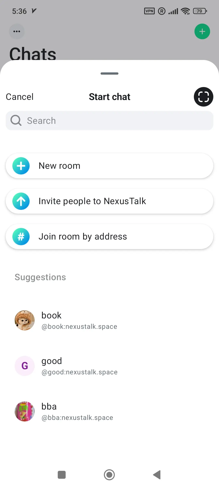
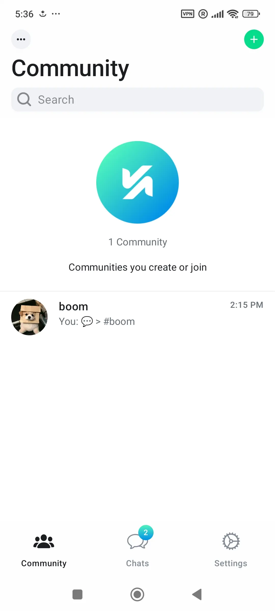
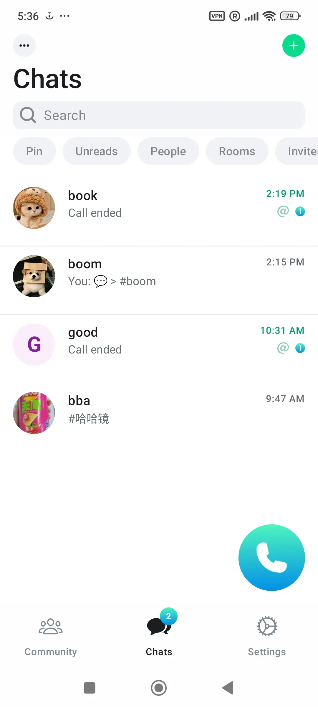
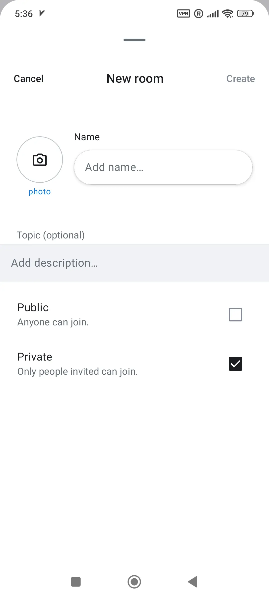
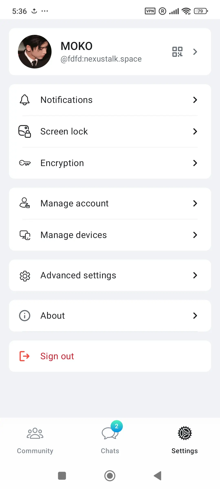

# NexusTalk Android

Matrix client based on [Element Android X](https://github.com/element-hq/element-x-android)
in the tradition of the original NexusTalk for Android
which was based on the now deprecated Element Android codebase.

Similarly to Element X, this NexusTalk Android rewrite should still be considered beta,
as it lacks some functionality which one might expect from a fully-featured chat app, compared to the old NexusTalk implementation.

An overview over changes compared to Element X can be found [here](FEATURES.md).

## Translations

If you want to translate NexusTalk, translation access details will be provided soon.  
Translations that concern upstream Element code are best contributed directly to Element, who currently manage translations on [localazy](https://localazy.com/p/element).

## Screenshots

  
 

## Building

In general, building works the same as for Element X or any common Android project.
Just import into Android Studio and make sure you have all the required SDKs ready.

## WYSIWYG development

To develop changes in our [matrix-rich-text-editor fork](https://github.com/matrix-org/matrix-rich-text-editor):

### Build WYSIWYG locally

- Clone the repo
- Bump the version number to some future version that [doesn't exist yet](https://github.com/matrix-org/matrix-rich-text-editor/tags)
  using `./update_version 1.2.3` where `1.2.3` is your chosen version number. By not re-using any existing version number you can make sure you're using your
  local build if the build of NexusTalk succeeds.
- Publish the wysiwyg by running `make android` in its directory. (Make sure you have `JAVA_HOME`, `ANDROID_NDK_HOME` and all the build dependencies setup)

### Include local-built WYSIWYG in NexusTalk

- Modify `settings.gradle.kts` to insert `mavenLocal()` into the `dependencyResolutionManagement {}` block.
- Change the version number of `wysiwyg` in `gradle/libs.versions.toml` to match the one you published locally.

## Contributing

Generally, contributions are welcome!  
Note that in order to ease upstream merges, we want to leave the smallest footprint possible on Element's sources
when implementing original features or patching Element's behaviour.

In particular (may change a bit while the project is still in alpha):
- Put code into additional files (`chat.nexustalk.*` package names) if reasonable
    - Prefer `nexustalk/lib` module if it doesn't depend on element modules (except maybe strings)
    - Prefer `nexustalk/components` module if it depend on some of Element's Design/UI components but nothing else
    - Otherwise, prefer element module where it makes most sense (or create a new module for bigger features, maybe)
- Put NexusTalk-specific drawables and other xml resources that override upstream resources into the `sc` build flavor
    - This way, we can use the same name and avoid merge conflicts
    - Compare e.g. `libraries/designsystem`: we define the flavor `sc` and thus put drawables in the `sc` instead of `main` directory.
      For new modules that do not feature a `sc` flavor yet, copy over the required `build.gradle.kts` content from a module that does.
- Put NexusTalk-specific strings into `nexustalk/lib`
    - Never touch upstream strings! If we want to change Element's strings, we'll either want a script that patches them,
      so we can restore upstream strings before upstream merges and re-do our changes automatically after the merge,
      or alternative put it into an `sc` build flavor, if we do not need to touch multiple translations.
- Don't worry too much about code style if violating it can ease upstream merges
    - When putting upstream code into a new block (e.g., putting it in an `if`-statement), don't indent the upstream code, but rather add comments like
      `// Wrong indention for merge-ability - start` and `// Wrong indention for merge-ability - end`
